#  讲解机器人部署

XBot机器人上二维码标识相关WIFI网名称
XBot IP:192.168.8.101
SSH: 用户xbot 密码xbot1234
ssh xbot@192.168.8.101

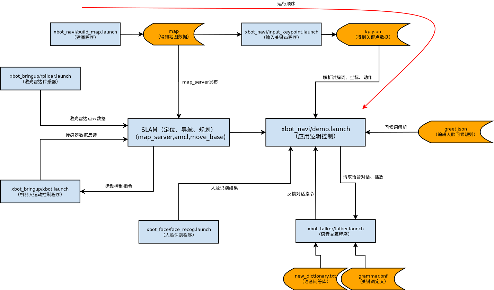

## 1. 人脸注册

人脸识别主机IP：192.168.8.141

注册用户查询：http://192.168.8.141:8000/management/userids
返回空时为为未有人注册。

人脸识别功能主要分为注册人脸，管理人脸和识别人脸三个部分。注册人脸分为人脸图片注册和实时拍照注册两种方式。

**1、停止xbot服务**
首先，将您的机器人连接显示器与键盘鼠标。因为机器人的开机自启动程序已经占用了人脸识别摄像头，所以要先在机器人的终端上输入如下指令终止全部服务

```bash
sudo service xbot stop 
```

**2、启动ROS**
释放人脸识别摄像头之后，继续输入下面指令启动ros

```bash
roscore
```
接下来就是任意从下面的两种人脸注册方式中选择一种进行人脸注册。目前支持使用摄像头交互注册和使用已有的照片注册两种方式，命令分别如下:
**3、注册人脸**

- 使用摄像头交互进行注册
```bash
rosrun xbot_face 01face_register.py camera 	[camera_index]
```
默认情况下是

```bash
rosrun xbot_face 01face_register.py camera 3
```

**摄像头交互注册步骤** 

- 使用摄像头交互注册，需要根据设备情况填写[camera_index]参数，该参数表示设备的id。我们可以通过以下命令查询:
```bash
ls /dev
```
执行后会得到以下结果:
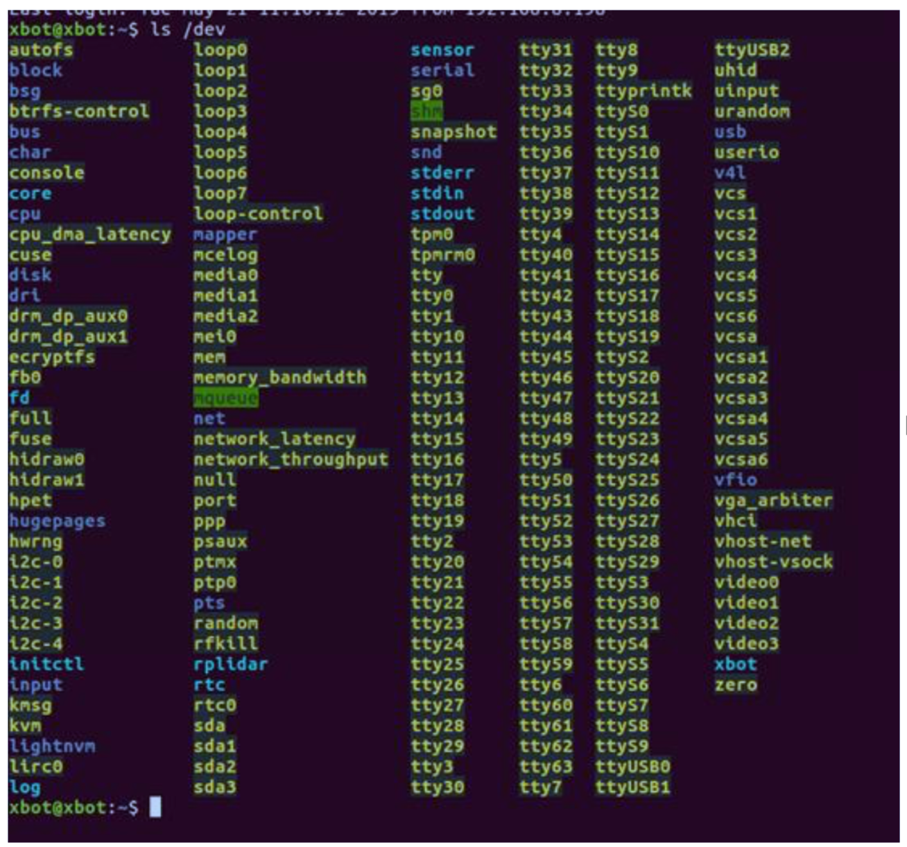
其中，video*这些设备就是摄像头设备，在机器人上一般有4个摄像头。其中video3是人脸注册摄像头，我们一般用该摄像头进行人脸注册，传入摄像头id号3，则命令如下:
```bash
rosrun xbot_face 01face_register.py camera 3
```
执行以上命令就会打开一个摄像头窗口，在窗口中能够清楚的看到图像信息。此时您需要用鼠标点击摄像头窗口(此时窗口处于激活状态)，然后将人脸置于窗口中间，调整人脸在窗口中的位置和清晰度，合适时，按下**R**键，此时摄像头窗口的画面将会定格。
然后返回到终端，命令窗口会提示您**输入姓名拼音**，如"xjpcnew03"(注意**要加双引号**)并回车，如果下一行返回的是 **0，表示注册成功**，其后只需要鼠标点击摄像头窗口并按Q或者直接在终端键入**ctrl+c**即可退出人脸识别程序，此时就完成了一次人脸注册。
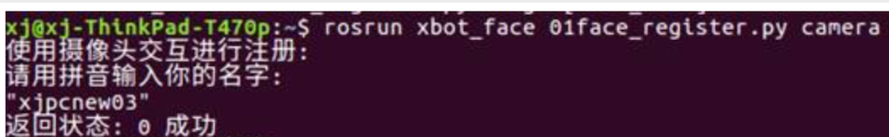

注册的信息可以通过在浏览器中直接输入接口`http://192.168.8.141:8000/management/userids`返回，查看返回结果是否包含刚刚注册的id:xjpcnew03。 

**使用照片进行注册**
```bash
rosrun xbot_face 01face_register.py camera 3
```
使用已有的照片进行人脸注册，需要设备上已经有了待注册用户的照片，此时我们只需要键入以下命令，并输入待命名的用户名(如xjimage01):
```bash
rosrun xbot_face 01face_register.py image xjimage01
```

回车执行命令之后，会弹出一个文件选择窗口，提示**选择人脸照片文件择照片** 根据人脸照片路径，选择照片即可完成注册。
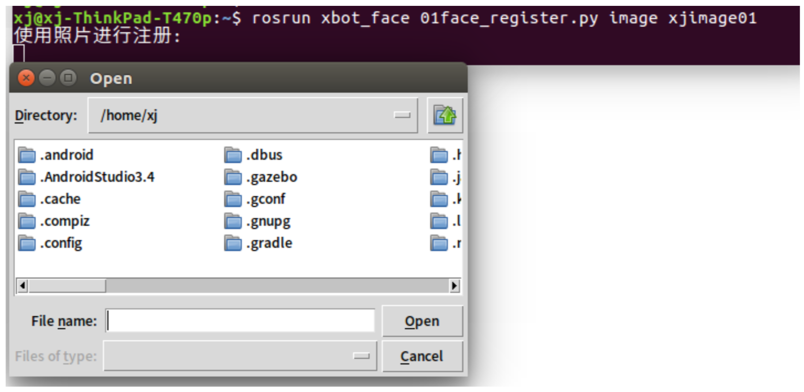

**注册成功，返回0**。
 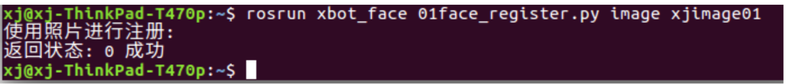

其它常见的人脸注册返回值信息查看人脸盒子接口说明书：
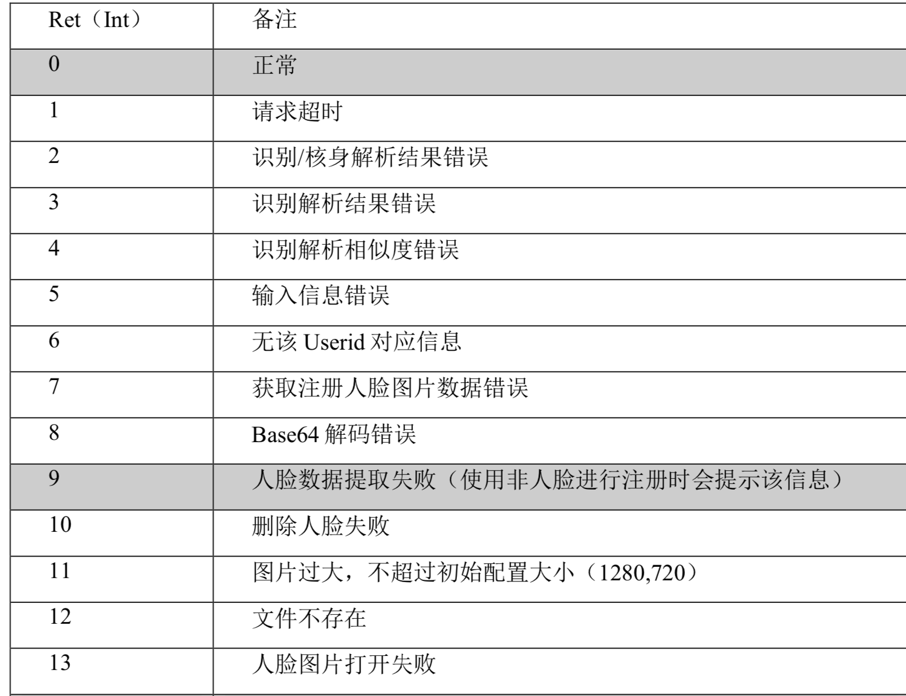
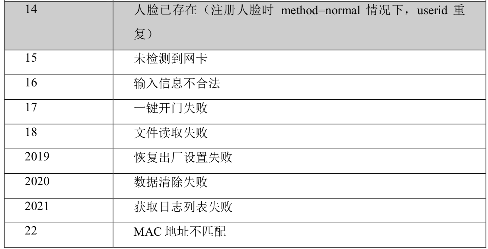

## 2. 语音交互
ssh登陆到xbot：

	ssh -X xbot@192.168.8.101
如报错，可先运行`unset SSH_ASKPASS`

然后可以通过修改以下两个配置文件自定义对话内容。

* 01.修改 `xbot_talker/assets/grammar.bnf` 语法文件。
  bnf 语法使用一种结构描述了用户可能说出的语言范围和构成模式。简单来 说，机器人只能够识别该文件中定义的关键词。该文件可用 WPS 打开并编 辑。打开文件后，用户可直接在的最后添加自定义的关键词，例如，添加 关键词“你有弟弟吗”“你弟弟是谁”:
  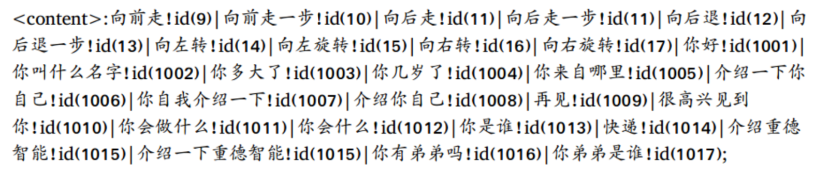
  关键词之间用“| ”分隔开，“!id”后面小括号里的数字，依次往后加 1 即 可，最后用分号“;”结束。

* 02.修改 `xbot_talker/assets/new_dictionary.txt` 文件，添加新的交互词典。
  打开 new_dictionary.txt 文件，在文件末尾，“}”和“]”之前添加自定义的交互信息。
  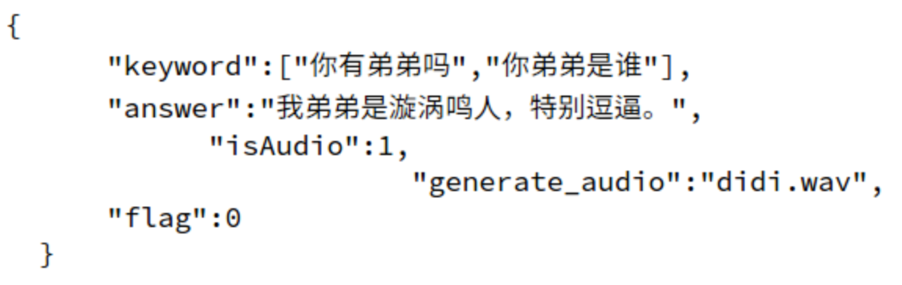
  每一组交互信息都用花括号“{}”括起来，每组信息之间用逗号“，”分隔开。

keyword 必须是 grammar.bnf 定义的关键词，否则机器人无法识别。 answer 代表自定义的回答，可以是回复的语句，也可以是控制机器人前进后退的指令。

**isAudio 标志**，1 表示把 answer 里的文字转化为语音播出，语音文件存放在自定义的 generate_audio 对应的【名称.wav 文件】里。

flag 标志，1 表示进行语音回答后机器人不需要进行额外动作，0 表示
机器人可能需要进行移动等动作。 

修改完以上两个配置文件之后,使用进行交互。
	$ rosservice call /xbot/chat "start_chat: true"
执行该指令后，机器人会在一段时间内发出“嘟——嘟——”声，您在 听到声音之后即可以开始与机器人交谈。

结束对话时需要告诉机器人“关闭”。在机器人接收到语音输入的关闭 指令后，会结束对话，在/chat 服务端返回 success。

初始配置的机器人已经能够回答一些简单的问题，包括:你好、你多大了、你是谁、你叫什么名字、你会什么、介绍一下你自己等等，如果要设置更多问答以及更丰富的交互场景，您可以按照 3.2.4 小结的教程进行自 定义对话内容。

初始配置的部分对话内容如下，用户可输入含有关键词的语音，与机器人进行交互。例如，如果问机器人“你几岁了?”，由于语音中包含关键词“几岁”，机器人就会根据已定义好的回答，回应“我已经三岁了”。
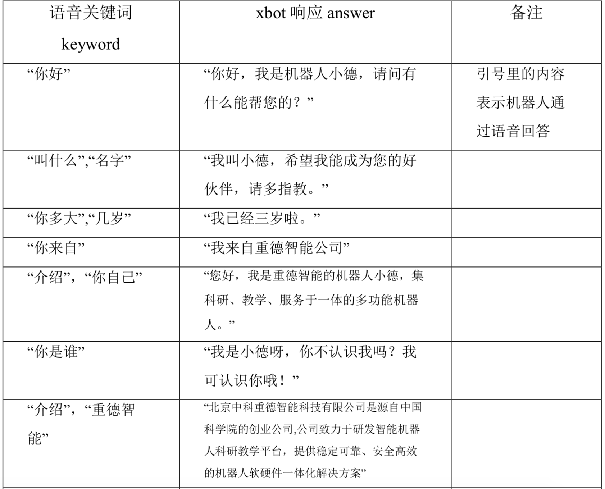
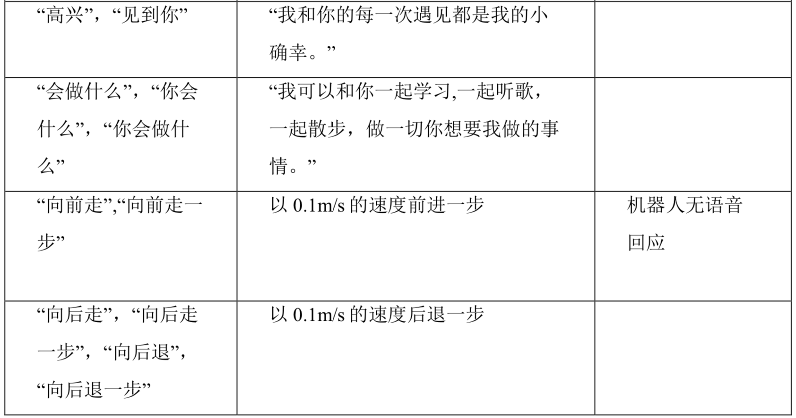
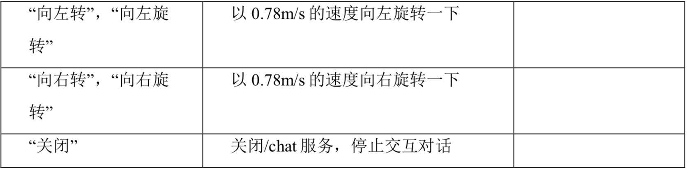

##   3. 主从配置
在笔记本~/.bashrc文件的最后添加：
```bash
export ROS_HOSTNAME=192.168.8.101
export ROS_MASTER_URI=http://192.168.8.101:11311
```
添加完后使用source执行 ~/.bashrc或新打开终端
```bash
source ~/.bashrc
```

##   4. 建图、标记关键点

1. 建图
在笔记本上输入指令进入XBot
```bash
ssh xbot@192.168.8.101
sudo service xbot stop
```

（1）启动建图功能

```bash
roslaunch xbot_navi build_map.launch
```

（2）建图效果可视化
如您已在从机部署catkin_ws则运行如下命令

```bash
roslaunch xbot_navi rviz_build_map.launch
```

（3）移动机器人完成建图
在 RViz 中，中间区域显示的是 XBot-U 机器人建立的地图信息，选择上方**MoveCamera** 按钮可以调整地图视角，其中，按住鼠标左键拖动可旋转地图。滚动鼠标滚轮可以放大和缩小地图，按住鼠标滚轮拖动可以调整地图位置，此时可以通过您手动控制机器人的移动，使其遍历整个环境。
打开一个新的终端，输入如下指令，也可在rviz中鼠标拖动`simple2d goal`

```bash
$ rosrun xbot_tools keyboard_teleop.py
```

```

当焦点在该终端上是，通过键盘上的按键，可以手动控制机器人的移动，按键与机器人运动对照关系如下表：
按键 运动
i 向前
k 停止
, 向后
j 顺时针旋转
l 逆时针
需要注意的是，建图需要机器人移动，因此接口不适合接入有线设备（如显示器、有线鼠标键盘等），因此在通过键盘命令驱动机器人运动时，建议采用ssh远程控制或者在PC从机上控制的方式。且在手动控制机器人移动时，机器人不会自主避障，如果将要发生碰撞，可以通过机器人地盘
上的红色按钮紧急制动。
注意：一次建图不成功可以反复进行多次建图。

（4） 保存地图：
​```bash
roscd xbot_navi/map
rosrun map_server map_saver -f [filename]
```
保存地图,807即为保存的地图文件名。

```bash
rosrun map_server map_saver -f 807
```
把地图拷贝到xbot_navi/map目录下,如

```bash
mv 807.* ~/catkin_ws/src/xbot_navi/map
如地图原保存在笔记本,可
sftp xbot@192.168.8.101
put 807.*
后执行mv操作
```

ctrl_c关闭之前启动的rviz和buildmap程序

2.创建关键点

（1） 修改~/catkin_ws/src/xbot_navi/launch/input_keypoints.launch文件中的mapfile

```xml
<arg name="map_file"       default="$(find xbot_navi)/map/807.yaml" />
```
（2）

```bash
roslaunch xbot_navi input_keypoints.launch
rosrun xbot_navi input_keypoint.py
#如在笔记本启动上述程序,地图和修改需在笔记本执行,xbot先运行roscore.
#如在xbot启动上述程序,请连接显示器
```
按照命令窗口的提示，输入即将定义的关键点个数。在rviz中，点击2D Nav Goal, 在地图上点击设置访问点。个数与之前定义的个数一致。假设定义了3个访问点，当你已经在rviz中设置了3个，脚本会将当前目录下自动生成kp.json文件，并将信息自动保存到kp.json文件中。**将当前目录下的kp.json文件移动到catkin_ws/src/xbot_navi/param/**

## 5. 其他配置 

（1）打开demo.launch⽂件，修改map_file

```xml
<arg name="map_file" default="$(find xbot_navi)/map/807.yaml" />

修改kp.json⽂件和greet.json⽂件的路径
xml
<node name = "demo" pkg = "xbot_navi" type = "demo.py">
	<param name = "/demo/kp_path" value = "$(find xbot_navi)/param/kp.json" />
	<param name = "/demo/greet_path" value = "$(find xbot_navi)/param/greet.json" />
</node>
```

（2）定义greet.json⽂件

```bash
没有greet.json⽂件的，按照以下格式⽣成greet.json（这个⽂件定义的是⼈脸识别⽤⼾）
{
	"liyaoning":{"isVIP":true,"greet_words":"李曜宁，你好"},
	"matao":{"isVIP":true,"greet_words":"马涛，你好"}
}
如：“xijing”为人脸注册的用户名；“hello”为人脸识别成功后xbot播放的语音（可自定义设置）。
```

（3）打开demo.py⽂件，修改：
修改kp.json和greet.json⽂件路径


```bash
self.kp_path =rospy.get_param('/demo/kp_path','/home/xbot/catkin_ws/src/xbot_navi/param/kp.json')

self.greet_path =rospy.get_param('/demo/greet_path','/home/xbot/catkin_ws/src/xbot_navi/param/greet.json')
  
将demo.py脚本中所有的`self.play_srv(False, 2, '', kp['play_words'])` 第⼆个参数由1更换为2。修改以下路径，chat和play前注意加上/xbot
		
# 请求chat服务
self.chat_srv = rospy.ServiceProxy('/xbot/chat',chat)
# 请求播放服务
self.play_srv = rospy.ServiceProxy('/xbot/play',play)
```

（4）启动路线

```bash			
roslaunch xbot_navi demo.launch
```

成功启动后，进行人脸识别，已注册人脸识别成功后，xbot会播放greet.json文件中预设的“greet_words”听到“嘟声”后，向xbot发出“参观”的语音指令，机器人会向预设的目标点开始行进。

